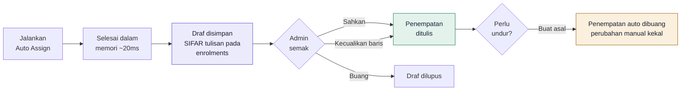

<div align="center">

# Jadual Kelas Student Auto

**Sistem penjadualan kelas automatik untuk sekolah dan pusat tuisyen.**

Admin menekan satu butang. Sistem mengagihkan ratusan pelajar ke dalam kelas
mengikut peraturan yang boleh dihidup-matikan — dan menerangkan sebab setiap
penempatan dalam Bahasa Malaysia.

[](https://laravel.com)
[](https://php.net)
[](https://react.dev)
[](https://postgresql.org)
[](#ujian)
[](#kualiti-kod)

</div>

---

## Masalah

Penempatan pelajar ke dalam kelas diuruskan secara manual dalam Google Sheets.
Ia lambat, mudah silap, dan tiada rekod **kenapa** seseorang pelajar berada dalam
kelas tertentu.

Peraturan sebenar yang perlu dipatuhi hidup dalam kepala admin, bukan dalam sistem:

- adik-beradik jangan sekelas — kecuali keluarga tertentu yang **mahu** mereka bersama
- pelajar bermasalah perlu cikgu yang tegas
- setiap kelas kena seimbang lelaki dan perempuan
- jangan lebih 30 orang sekelas, dan jangan lebih daripada muatan bilik

## Penyelesaian

<table>
<tr><td width="50%" valign="top">

**Sebelum**

Google Sheets. Seret-dan-lepas manual. Berjam-jam setiap penggal. Tiada jejak
audit. Bila ditanya "kenapa Ali dalam 5 BETA?", jawapannya bergantung pada ingatan.

</td><td width="50%" valign="top">

**Selepas**

Satu butang. **228 pelajar ditempatkan dalam ~20 ms.** Setiap penempatan membawa
ayat sebabnya. Admin melihat cadangan dahulu, boleh menolak mana-mana baris, dan
boleh membuat asal selepas mengesahkan.

</td></tr>
</table>

Contoh sebab sebenar yang dijana sistem:

> **Diletakkan dalam 6 ALPHA:** cikgu tegas (Cikgu Rahim) kerana pelajar bermasalah;
> adik-beradik Aiman Firdaus diasingkan; membantu imbangan jantina (14 L / 14 P)

---

## Kandungan

- [Susunan teknologi](#susunan-teknologi)
- [Bermula](#bermula)
- [Enjin penempatan](#enjin-penempatan)
- [Aliran kerja](#aliran-kerja)
- [Integriti data](#integriti-data)
- [Import & eksport](#import--eksport)
- [Integrasi](#integrasi)
- [Keselamatan & PDPA](#keselamatan--pdpa)
- [Ujian](#ujian)
- [Deploy](#deploy)

---

## Susunan teknologi

| Lapisan | Teknologi |
|---|---|
| Backend | Laravel 13 · PHP 8.4 |
| Pangkalan data | PostgreSQL 17 |
| Cache & baris gilir | Redis |
| Frontend | Inertia 3 · React 19 · TypeScript · Tailwind 4 · shadcn/ui |
| Animasi & carta | Motion · Recharts |
| Kualiti | Pest · PHPStan (level 7) · Pint · Prettier |
| Pembangunan | Docker Compose |
| Produksi | Dockerfile berbilang peringkat (nginx + php-fpm + queue + scheduler) |

**Saiz projek:** 113 fail PHP (~7,900 baris) · 90 komponen React ditulis tangan
(~9,100 baris) · 28 halaman Inertia · 23 migrasi · 32 jadual · 35 fail ujian

---

## Bermula

Mesin pembangunan **tidak perlu PHP atau Composer** — semuanya berjalan dalam Docker.

```bash
git clone git@github.com:yusufzmi-coder/yusufazmi.git jadual-auto
cd jadual-auto
cp .env.example .env

make up                        # bina & naikkan app, nginx, postgres, redis
make art c="key:generate"
make fresh                     # migrasi + data contoh
make npm c="run build"
```

Buka **http://localhost:8080** dan log masuk:

```
admin@jadual.test / password
```

Data contoh: **236 pelajar · 18 kelas · 12 guru · 9 bilik · 34 keluarga.**
Pelajar sengaja dibiarkan tanpa kelas — tekan **Jalankan Auto Assign** untuk
melihat sistem bekerja.

<details>
<summary><b>Arahan berguna</b></summary>

<br>

| Arahan | Kegunaan |
|---|---|
| `make test` | Jalankan semua ujian Pest |
| `make stan` | Analisis statik PHPStan |
| `make pint` | Format kod PHP |
| `make sh` | Shell dalam container app |
| `make fresh` | Migrasi semula + seed |
| `make art c="assign:run"` | Auto assign dari CLI (`--commit` untuk sahkan) |
| `docker compose up vite` | Hot reload semasa mengedit UI |

</details>

---

## Enjin penempatan

Solver ialah **fungsi tulen ke atas snapshot dalam memori** — tiada akses pangkalan
data di dalam gelung. Itulah sebabnya ia laju, boleh diuji, dan memberikan hasil
yang sama setiap kali.

### Kenapa bukan CSP/ILP solver

**Greedy paling-terkekang-dahulu + pembaikan carian setempat.**

Solver kekangan sebenar ditolak atas dua sebab. Pertama, tiada solver PHP yang
matang — anda terpaksa memanggil Python atau membungkus binari, menambah
kebergantungan operasi untuk alat dalaman seorang admin. Kedua, dan lebih penting:
**ILP memulangkan vektor optimum tanpa naratif.**

Keperluan di sini ialah admin membaca satu ayat Bahasa Malaysia dan angguk. Tiada
siapa dapat membezakan penyelesaian 0.94-optimum daripada 1.00-optimum — tetapi
semua orang perasan penyelesaian yang tidak boleh dijelaskan.

### Peraturan

| Peraturan | Jenis | Boleh dimatikan |
|---|---|---|
| Padanan Tahun | keras | ✗ |
| Kapasiti Bilik | keras | ✗ |
| Had Maksimum Kelas | keras | ✓ |
| Kelas Adik Beradik | lembut (dwiarah) | ✓ |
| Pelajar Bermasalah → Cikgu Tegas | lembut | ✓ |
| Seimbangkan Jantina | lembut | ✓ |

Kapasiti berkesan ialah `min(had peraturan, kapasiti bilik)`. Mematikan "Had
Maksimum Kelas" **tidak** membenarkan 40 pelajar masuk bilik 25 tempat —
`RoomCapacityRule` berasingan dan tidak boleh dimatikan.

Peraturan lembut memulangkan skor dalam julat `[-1.0, 1.0]`, kemudian didarab
dengan berat yang admin tetapkan. Penormalan itu wajib: tanpanya, peraturan yang
memulangkan kiraan mentah akan senyap-senyap menenggelamkan semua yang lain, dan
slider berat menjadi tidak bermakna.

<details>
<summary><b>Menambah jenis peraturan baharu — empat langkah, tiada migrasi</b></summary>

<br>

1. Laksanakan `HardConstraint` atau `SoftPreference`
2. Daftarkan kelas dalam `config/assignment.php`
3. Tambah teks Bahasa Malaysia dalam `lang/ms/assignment.php`
4. Tambah borang konfigurasi React dalam peta `ruleConfigForms`

Ada ujian yang berjalan melalui registry dan memastikan setiap kod sebab yang
boleh dikeluarkan mempunyai terjemahan — menangkap regresi klasik "tambah
peraturan, lupa teks Melayu".

</details>

### Adik-beradik dikenal pasti melalui keluarga, bukan penjaga

Hubungan adik-beradik datang daripada `students.family_id`, **bukan** daripada
penjaga yang dikongsi.

Sebabnya praktikal: "penjaga" dalam borang pendaftaran selalunya pemandu van,
makcik, atau ejen yang didaftarkan untuk lapan kanak-kanak tidak berkaitan.
Mengambilnya sebagai hubungan keluarga akan menghasilkan adik-beradik palsu, dan
enjin akan mengasingkan kanak-kanak yang langsung tiada kaitan.

`families.sibling_policy` membolehkan keluarga tertentu **meminta anak-anak mereka
sekelas**, mengatasi peraturan umum — kerana itu permintaan sebenar yang ibu bapa
buat.

### Determinisme

Menjalankan semula **tidak** mengocak semula sekolah:

- **Susunan menyeluruh** di setiap tempat, dengan `student_id` sebagai penambat — tiada `rand()`
- **Bonus incumbent** kecil menahan pelajar di kelas asal apabila skor seri
- **`input_hash`** — sha256 snapshot kanonik; hash sama ⇒ output sama, dan itu boleh diuji

Disahkan pada data sebenar: selepas mengesahkan 228 penempatan, menjalankan semula
memberi **228 `keep`, 0 `move`** — malah dalam mod `rebalance` di mana pemindahan
dibenarkan.

---

## Aliran kerja



### Pratonton, kemudian sahkan

`POST /auto-assign` menyelesaikan dalam memori dan menyimpan **draf** sahaja —
sifar tulisan pada `enrolments`.

Semasa commit, `input_hash` disemak semula. Jika admin lain menambah pelajar atau
mengubah berat peraturan sementara itu, draf **ditolak dengan mesej jelas** dan
bukan dilaksanakan atas andaian yang sudah basi.

### Penempatan manual

Panel senarai kelas membenarkan admin menambah, memindah, mengeluarkan dan
menyemat pelajar seorang demi seorang. Semuanya melalui `EnrolmentManager` yang
sama seperti enjin, jadi had tahun dan kapasiti dikuatkuasakan pada laluan manual
juga — mustahil untuk membina senarai yang enjin anggap tidak sah.

**Semat kekal melintasi pemindahan.** Kalau tidak, memindahkan pelajar akan
senyap-senyap menyerahkannya semula kepada enjin — bertentangan dengan tujuan semat.

### Buat asal

Larian yang telah disahkan boleh dibuat asal. Dua peraturan sengaja ketat:

- **Hanya larian terakhir yang disahkan.** Membuat asal larian lama bermakna
  merungkai segala yang bertindan di atasnya, dan soalan "penempatan mana patut
  kembali?" tiada jawapan yang jujur.
- **Perubahan manual selepas commit dibiarkan.** Keputusan sedar admin mengatasi
  rollback automatik.

---

## Integriti data

Kunci advisory memberikan mesej ralat yang baik, tetapi **sempadan ketepatan
sebenar ialah indeks unik separa PostgreSQL** — 15 daripadanya merentasi skema:

```sql
-- Seorang pelajar hanya boleh ada satu kelas aktif setiap sesi
CREATE UNIQUE INDEX ON enrolments (session_id, student_id) WHERE status = 'active';

-- Pertembungan bilik dan guru, dikuatkuasakan oleh pangkalan data
CREATE UNIQUE INDEX ON class_meetings (session_id, day, time_slot_id, room_id)
    WHERE room_id IS NOT NULL;
CREATE UNIQUE INDEX ON class_meetings (session_id, day, time_slot_id, teacher_id)
    WHERE teacher_id IS NOT NULL;
```

Pangkalan data secara fizikal tidak boleh mendaftarkan pelajar dua kali atau
membenarkan pertembungan, walaupun setiap kunci aplikasi gagal. Ralat `23505`
ditangkap dan diterjemahkan kepada ayat yang menamakan konflik sebenar:

> Bilik 1 sudah digunakan oleh kelas 4 ALPHA pada Isnin 8:00 AM – 9:00 AM.

### Sejarah tidak pernah hilang

Pemindahan kelas **bukan** `UPDATE class_id`. Baris lama ditutup
(`status = 'moved'`, `left_at`), baris baharu dimasukkan. Sejarah datang percuma,
dan "kenapa Ali dalam 5 BETA" boleh dijawab selama-lamanya.

### Lajur dijana

`classes.name` ialah lajur `GENERATED ALWAYS` PostgreSQL:

```sql
name varchar(30) GENERATED ALWAYS AS (year_level::text || ' ' || stream) STORED
```

"4 ALPHA" tidak boleh menyimpang daripada bahagiannya kerana ia tidak pernah ditulis.

---

## Import & eksport

### Import daripada Google Sheets

Tiga langkah: muat naik, semak, sahkan. Tiada apa ditulis sehingga anda menekan Import.

- Menerima **CSV dan XLSX**
- **Pemetaan lajur diteka automatik** daripada tajuk biasa dan boleh dibetulkan
- Menerima cara sebenar orang menulis: `Lelaki` / `L` / `M` / `Male`, dan tingkah
  laku sebagai label (`Bermasalah`) atau nombor (`2`)
- Baris bermasalah **dilaporkan dengan nombor barisnya** dan dilangkau — tidak
  pernah diteka. Baris sah tetap diimport
- **Kod pelajar sedia ada dikemas kini, bukan diduplikasi** — selamat mengimport
  semula fail yang dibetulkan
- Lajur *Keluarga* memautkan adik-beradik

### Eksport

| Eksport | Format |
|---|---|
| Jadual mingguan | PDF (landskap) |
| Senarai pelajar setiap kelas | PDF |
| Semua pelajar | CSV |
| Statistik kelas | CSV |

CSV pelajar menggunakan **tajuk lajur yang sama seperti import** — jadi eksport,
betulkan dalam spreadsheet, dan import semula berfungsi sebagai satu kitaran.

Fail ditulis dengan BOM UTF-8; tanpanya Excel memaparkan nama Melayu sebagai sampah.
Eksport pelajar distrim dalam ketulan, jadi penggunaan memori kekal rata walau
berapa ramai pelajar.

---

## Integrasi

Semua kredensial diisi melalui **Tetapan → Integrasi** dalam UI. Ia disulitkan
dalam pangkalan data dan **mengatasi `.env`** semasa runtime, jadi kunci boleh
ditukar tanpa deploy semula. Setiap kad ada butang **Uji Sambungan** yang
benar-benar menghubungi perkhidmatan.

| Perkhidmatan | Kegunaan | Ujian sambungan |
|---|---|---|
| **Google Sign-In** | Log masuk admin | Sahkan konfigurasi & senarai jemputan |
| **Sendscape** | Emel transaksi | Hantar emel ujian sebenar |
| **Cloudflare R2** | Storan fail | Tulis, baca, dan padam fail sebenar |

**Google Sign-In adalah jemputan sahaja.** Akaun Google yang tiada dalam senarai
Pengguna **ditolak, bukan didaftarkan**. Log masuk Google membuktikan identiti,
bukan kebenaran — dan sistem ini menyimpan rekod kanak-kanak.

---

## Keselamatan & PDPA

- Medan PII (`national_id` pelajar dan penjaga) menggunakan cast `encrypted`.
  Ia menjadi **tidak boleh dicari**, dan itu diterima.
- Log aktiviti menggunakan **senarai benarkan**, tidak pernah `logAll()`.
  `national_id`, tarikh lahir, telefon, emel dan catatan tingkah laku **tidak
  pernah dilog** — jika tidak, jejak audit senyap-senyap menjadi salinan bayangan
  tidak bersulit bagi lajur paling sensitif dalam sistem. Ada ujian yang
  menguatkuasakan ini.
- Tiga peranan: **Super Admin**, **Admin**, **Guru** (baca sahaja).
- Header keselamatan asas melalui middleware; HSTS hanya atas HTTPS.
- Aplikasi mempercayai proxy Easypanel supaya kuki `secure`, HSTS, dan had kadar
  berdasarkan IP sebenar semuanya berfungsi di belakang Traefik.

---

## Ujian

```
173 ujian lulus · 675 penegasan · ~9 saat
PHPStan level 7 · TypeScript strict — kedua-duanya bersih
```

Ujian unit enjin **tidak menyentuh pangkalan data** — ia membina objek `Snapshot`
dengan tangan melalui pembantu `SnapshotBuilder`, jadi ia berjalan dalam milisaat.
Ujian feature berjalan terhadap **PostgreSQL sebenar**, kerana skema bergantung
pada indeks unik separa, lajur dijana, dan kunci advisory — tiada satu pun yang
SQLite ada.

<details>
<summary><b>Kes ujian yang paling penting</b></summary>

<br>

- **Kapasiti** — hormati kapasiti bilik walaupun peraturan had maksimum dimatikan
- **Adik-beradik dwiarah** — asingkan bila polisi `apart`; **satukan bila keluarga
  override kepada `together`**; dan bila mengasingkan mustahil, semua tetap
  ditempatkan **dan pelanggaran dilaporkan**, bukan ditelan
- **Bukan adik-beradik** — dua pelajar berkongsi penjaga tetapi berlainan keluarga
  *tidak* dianggap adik-beradik
- **Keutamaan keterukan** — satu tempat dengan cikgu tegas, satu `Kritikal` dan
  satu `Bermasalah` → `Kritikal` menang. *Ujian ini mustahil ditulis dengan
  boolean* — inilah justifikasi skala 0–3 dijadikan kod
- **Idempotensi** — selesai, commit, jalankan semula → setiap item `keep`, sifar `move`
- **Invarian pangkalan data** — pintas servis, masukkan dua enrolan aktif terus →
  `QueryException` 23505. *Menguji invarian, bukan kunci*
- **PDPA** — `attribute_changes` tidak pernah mengandungi `national_id` atau
  tarikh lahir
- **Terjemahan** — iterasi registry, sahkan setiap kod sebab ada teks Melayu

</details>

### Kualiti kod

```bash
make test    # Pest
make stan    # PHPStan level 7
make pint    # Laravel Pint
```

PHPStan berjalan pada **level 7** dengan baseline yang didokumenkan. Baseline itu
mengandungi bunyi generik Eloquent — dan empat tempat di mana PHPStan menyimpulkan
perhubungan sebagai bukan-null sedangkan skema membenarkan null. Di situ
ketepatan mengatasi laporan yang bersih: kod kekal `?->` dan kesnya dibaseline
dengan komen.

---

## Deploy

Imej produksi ialah Dockerfile berbilang peringkat: bina aset → nginx + php-fpm +
pekerja baris gilir + penjadual, semuanya disupervisi dalam satu container.

```bash
docker build -t jadual .
```

Entrypoint menunggu pangkalan data, menjalankan migrasi, seed asas (peranan, sesi,
slot masa, peraturan — **bukan** data contoh), mencipta admin pertama daripada
`ADMIN_EMAIL`, dan cache konfigurasi.

**Health check:** `/up`
**Halaman status:** root URL memaparkan kesihatan aplikasi, pangkalan data dan Redis

<details>
<summary><b>Pembolehubah persekitaran</b></summary>

<br>

```ini
APP_NAME="Jadual Kelas Student Auto"
APP_ENV=production
APP_DEBUG=false
APP_KEY=                     # php artisan key:generate --show
APP_URL=https://contoh.com
APP_LOCALE=ms
APP_FALLBACK_LOCALE=en
APP_TIMEZONE=Asia/Kuala_Lumpur

DB_CONNECTION=pgsql
DB_HOST=
DB_PORT=5432
DB_DATABASE=jadual
DB_USERNAME=jadual
DB_PASSWORD=

REDIS_HOST=
REDIS_PORT=6379
CACHE_STORE=redis
QUEUE_CONNECTION=redis
SESSION_DRIVER=database

# Digunakan SEKALI pada deploy pertama; diabaikan sebaik ada pengguna.
ADMIN_NAME="Admin"
ADMIN_EMAIL=
ADMIN_PASSWORD=
```

`ADMIN_PASSWORD` hanya digunakan semasa jadual `users` masih kosong. Redeploy
tidak akan menghidupkan semula akaun yang dibuang atau menetapkan semula kata
laluan yang sudah ditukar.

Alternatif tanpa meletakkan kata laluan dalam env:

```bash
php artisan admin:create anda@domain.com --name="Nama Anda"
```

Ia menjana kata laluan kuat dan memaparkannya sekali sahaja.

</details>

---

## Peta jalan

**Sudah siap** — enjin penempatan, jadual mingguan, CRUD penuh, import/eksport,
penempatan manual, buat asal, integrasi, dashboard dan statistik.

**Belum termasuk**

- Payment gateway (CHIP) — ditangguhkan; widget Integrasi sudah direka menerimanya
- Portal ibu bapa
- Penandaan kehadiran oleh guru

---

<div align="center">
<sub>Dibina dengan Laravel 13 · PHP 8.4 · PostgreSQL 17 · React 19</sub>
</div>
